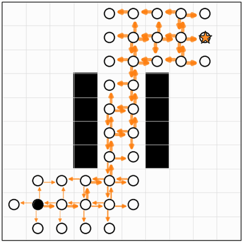
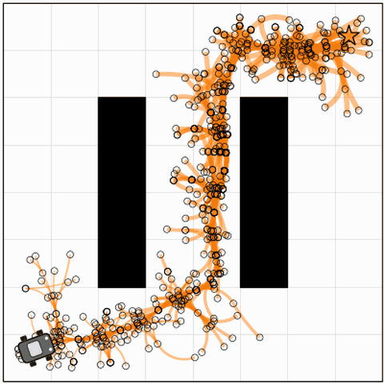
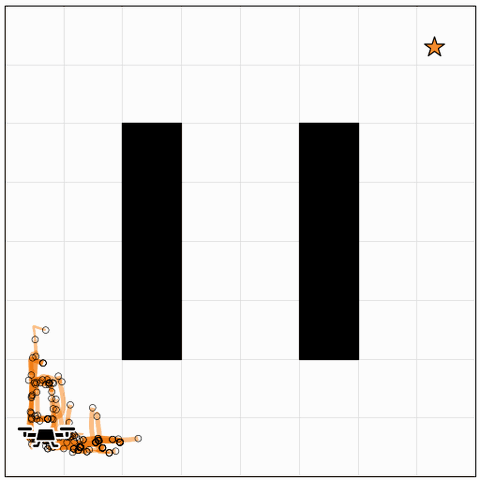
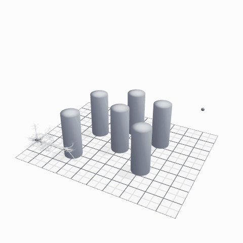

# Monte Carlo Tree Search Tutorials

Tutorial notebooks for the IROS 2026 Workshop on Search Algorithms for Robot Learning.

## Table of contents

| Tutorial | Code |
| :---: | :---: |
| **Grid World**  | [Jupyter Notebook](mcts_grid_world.ipynb) [Google Colab](https://colab.research.google.com/github/MaxMSun/mcts-tutorial/blob/main/mcts_grid_world.ipynb) |
| **Continuous Navigation**  | [Jupyter Notebook](mcts_continuous_navigation.ipynb) [Google Colab](https://colab.research.google.com/github/MaxMSun/mcts-tutorial/blob/main/mcts_continuous_navigation.ipynb) |
| **Spectral Quadrotor (2D)**  | [Jupyter Notebook](mcts_spectral_quadrotor.ipynb) [Google Colab](https://colab.research.google.com/github/MaxMSun/mcts-tutorial/blob/main/mcts_spectral_quadrotor.ipynb) |
| **Spectral Quadrotor (3D)**  | [Jupyter Notebook](mcts_spectral_quadrotor_3d.ipynb) [Google Colab](https://colab.research.google.com/github/MaxMSun/mcts-tutorial/blob/main/mcts_spectral_quadrotor_3d.ipynb) |

## Bellmax and LQRax

[**Bellmax**](bellmax.py) is a compact Monte Carlo tree search solver built with JAX. It provides customizable actions, dynamics, rewards, and search policies, with built-in tree management and value backups.

[**LQRax**](lqrax.py) is a differentiable continuous-time LQR solver built with JAX, adapted from [LQRax](https://github.com/MaxMSun/lqrax). It provides feedback control through backward integration of the Riccati equations. It can be used with *Bellmax* to combine tree search with feedback control for planning with nonlinear systems.

## License

Distributed under the [GNU General Public License v3](LICENSE).
